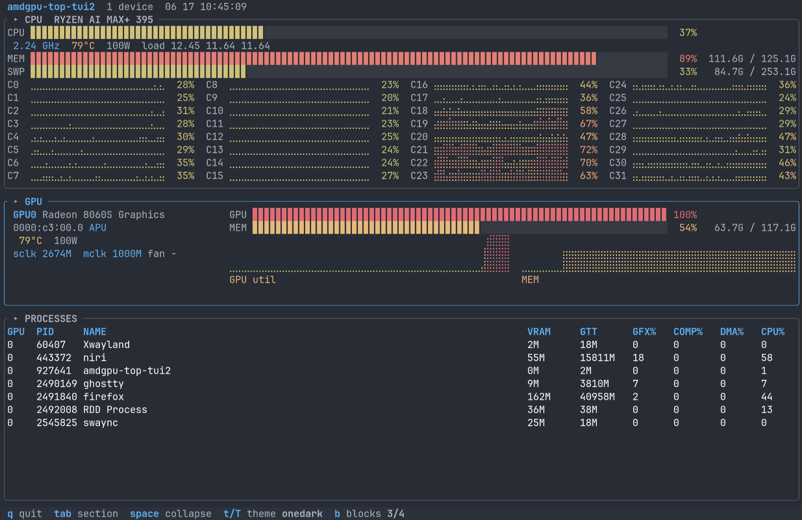

# amdtop

**amdtop is an independent terminal system monitor for AMD systems.** It is
inspired by the modern TUI visual style of
[nvitop](https://github.com/XuehaiPan/nvitop) and
[btop](https://github.com/aristocratos/btop), and leverages the published
[`libamdgpu_top`](https://crates.io/crates/libamdgpu_top) crate for AMD GPU
telemetry. It monitors CPUs, AMD GPUs (discrete and APUs), and Strix Halo XDNA
NPUs.



## Why

`nvitop` is great but NVIDIA-only. On AMD — especially a Strix Halo box with an
APU **and** an XDNA NPU, or a workstation with multiple AMD cards there was no 
single TUI with that look-and-feel. amdtop fills that gap by combining its own
CPU/system monitoring with `libamdgpu_top` telemetry in a modern, themeable
layout.

## Features

- **Collapsible CPU / GPU / NPU / Processes sections** (state persists across runs)
- **CPU section, btop-style**: per-core grid with braille history mini-graphs,
  package temp/power, load average, plus system MEM/SWP
- **Multi-GPU**: one band per device, labeled by index + PCI bus-id
- **APU-aware memory**: shows the real GTT (unified system RAM) pool on APUs,
  VRAM on discrete cards — both labeled `MEM`
- **Adaptive memory-bandwidth telemetry**: shows memory-controller utilization
  where available alongside SoC DRAM read/write throughput on supported APUs
- **XDNA NPU**: presence detection on `/sys/class/accel`; utilization + per-context table when the `amdxdna` driver exposes DRM fdinfo telemetry
- **Process table**: per-process resident system memory (`MEM`), VRAM/GTT,
  and engine usage
- **41 native bundled themes**: available without btop or external data files;
  cycle live with `t`/`T`. Defaults to `tokyo-night`.
- nvitop-style fixed-track gauges with aligned numeric columns; braille area
  graphs with theme-gradient fills

## Install

Requires **Rust 1.88 or newer** and **`libdrm` development headers**, plus an
AMD GPU/APU running the `amdgpu` kernel driver.

Install from crates.io:

```sh
cargo install amdtop
```

On Arch Linux and derivatives, install the
[`amdtop`](https://aur.archlinux.org/packages/amdtop) AUR package
([pkg](https://github.com/lhl/amdtop-aur)):

```sh
yay -S amdtop
```

Or install the latest development version from Git:

```sh
cargo install --git https://github.com/lhl/amdtop
```

This installs the `amdtop` binary. The published `libamdgpu_top` crate is
pulled from crates.io and compiled automatically. The only runtime dependency
is `libdrm_amdgpu.so.1`, which is present on systems with AMD drivers.

Distro packages for the `libdrm` build headers:

| Distro | Package |
|---|---|
| Arch | `libdrm` |
| Debian/Ubuntu | `libdrm-dev` |
| Fedora | `libdrm-devel` |

### NPU telemetry requirements

`amdtop` detects AMD XDNA/Ryzen AI NPUs through the Linux accel
class (`/sys/class/accel` and `/dev/accel/accel*`). On systems like Strix Halo,
that is enough for the NPU pane to show the device name, firmware, and BDF.

Live NPU utilization and the per-process/context table require extra telemetry
from the `amdxdna` kernel driver via DRM fdinfo. If your driver exposes fdinfo,
opening `/dev/accel/accel0` should show `drm-*` fields such as
`drm-driver`, `drm-pdev`, and `drm-engine-npu-amdxdna`:

```sh
python3 - <<'PY'
import os
fd = os.open('/dev/accel/accel0', os.O_RDWR)
print(open(f'/proc/self/fdinfo/{fd}').read())
PY
```

Expected fdinfo-capable output includes lines similar to:

```text
drm-driver: amdxdna_accel_driver
drm-pdev: 0000:c4:00.1
drm-engine-npu-amdxdna: 0 ns
drm-total-memory: 0 KiB
```

If those `drm-*` lines are missing, the app still shows the NPU pane, but the
utilization gauge is `N/A` and the pane reports `amdxdna fdinfo telemetry
unavailable`. This means the NPU is present, but the loaded kernel module does
not provide the standard fdinfo counters that this TUI reads.

#### Arch / AUR notes

Recent Arch kernels include the in-tree `amdxdna` driver, but not every kernel
build has the fdinfo patches needed for monitoring. For Strix Halo testing, the
most relevant AUR package is:

```sh
yay -S amdxdna-dkms
```

`amdxdna-dkms` provides a newer DKMS `amdxdna` module and firmware, and its
upstream lists Strix Halo (`17f0:11`) support. Make sure the matching kernel
headers for your booted kernel are installed (`linux-headers`,
`linux-mainline-headers`, etc.). Reboot after installing, then run the fdinfo
check above.

Arch also packages the XRT userspace plugin:

```sh
sudo pacman -S xrt-plugin-amdxdna
```

That package is useful for XRT workloads and tools such as `xrt-smi`, but it is
not a replacement for an fdinfo-capable kernel module. The older AUR
`amdxdna-driver-bin` / `xrt-npu-git` packages exist, but appear to target older
XDNA stacks; prefer `amdxdna-dkms` for the kernel driver unless you specifically
need to test that older stack.

## Usage

```sh
amdtop
```

### GPU numbering

amdtop lists all physical GPUs in PCI BDF order and shows each BDF beside its
index. This normally matches the physical ordering from `rocm-smi` and
`rocminfo`. `HIP_VISIBLE_DEVICES` and `ROCR_VISIBLE_DEVICES` can hide or remap
GPU ordinals inside a particular compute process; they do not change amdtop's
system-wide numbering. Use the displayed PCI BDF as the authoritative mapping.

### Keybindings

| Key | Action |
|---|---|
| `q` / `Esc` | quit |
| `Tab` / `Shift+Tab` | move between sections |
| `Space` / `Enter` | collapse / expand the focused section |
| `t` / `T` | next / previous theme |
| `b` / `B` | next / previous gauge block style |

Section collapse state, the selected theme, and the gauge block style all
persist across runs.

## Configuration

amdtop stores its UI state in:

```text
$XDG_CONFIG_HOME/amdtop/state.json
```

If `XDG_CONFIG_HOME` is unset, it uses `~/.config/amdtop/state.json`.

### GPU power management

A GPU that is already runtime-suspended when amdtop starts remains listed as
`sleeping`; amdtop does not wake it merely to collect telemetry. When another
workload wakes the GPU, amdtop initializes its telemetry in place without
changing the GPU's index.

For GPUs that are awake when monitoring begins, amdtop keeps discrete-GPU
device handles open. This avoids stale utilization and sensor readings after a
low-power transition or system resume. To allow runtime D3Hot power management
while amdtop is running, set `AGT_NO_DROP=0`; doing so may make telemetry
unavailable until amdtop is restarted.

### Gauge block styles

Cycle the bar fill glyph with `b`/`B`:
`3/4` (▊, default), `smooth` (precise fractional █), `dotmatrix` (⣿ LED cell),
`lines` (━/─), `squares` (■/□), `rects` (▮/▯), `pills` (▰/▱).

## Themes

amdtop embeds 41 themes in its binary, so theme selection does not depend on
btop being installed. Native custom themes use amdtop's versioned TOML format
and can independently style CPU, GPU, memory, NPU, processes, borders, clocks,
power, fans, bandwidth, and positioned gradient stops.

User themes are loaded from `$XDG_CONFIG_HOME/amdtop/themes/` and
`~/.config/amdtop/themes/`; system themes may be installed under
`/usr/local/share/amdtop/themes/` or `/usr/share/amdtop/themes/`. A native file
with the same name as a bundled theme overrides it. See
[the native theme format](docs/THEMES.md) for the complete schema and examples.

## Credits

- AMD GPU telemetry: [`libamdgpu_top`](https://crates.io/crates/libamdgpu_top) by Umio-Yasuno
- Inspiration: [nvitop](https://github.com/XuehaiPan/nvitop), [btop](https://github.com/aristocratos/btop)
- Themes from btop and original theme authors; see [THIRD_PARTY.md](THIRD_PARTY.md)

## License

Apache-2.0
